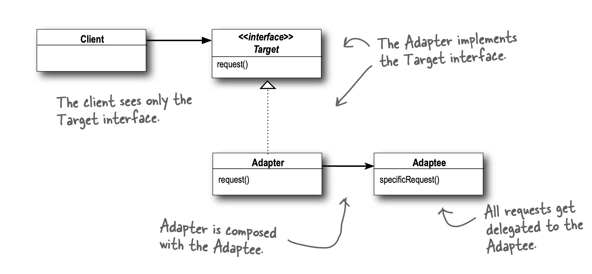
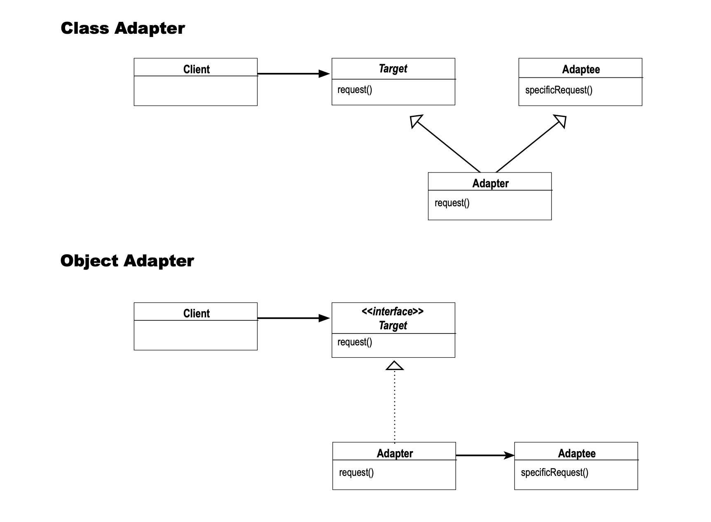
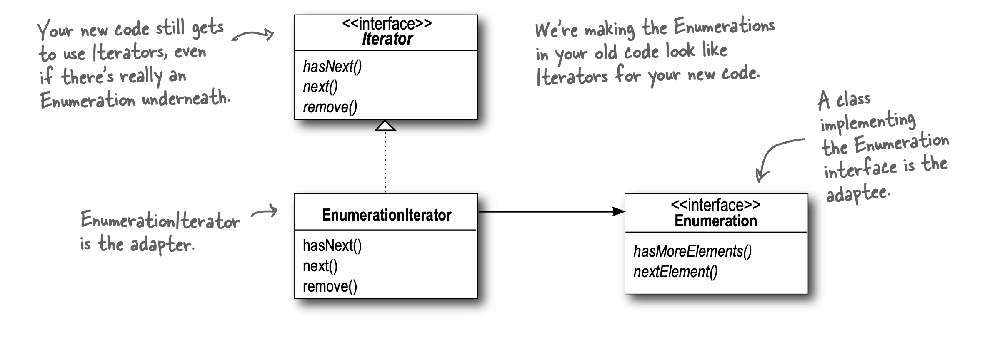

# Adapter

Converts interface of a class into another interface that client expects.
Lets classes work together that otherwise couldn't because of incompatible interfaces.

- Adapters take an interface and adapt it to one that client is expecting.
  - If it walks like a duck and quacks like a duck, it might be turkey wrapped with duck adapter.
- Client makes request to adapter by calling a method on it using target interface.
- Adapter translates request into one or more calls on the adaptee using adaptee interface.
- Client receives results of call and never knows there is an adapter doing translation.
- 2 kinds of adapters:
  - Object adapters (Composition)
  - Class adapters (Inheritance, infeasible unless language supports multiple inheritance)
- For class adapter, the adaptee and target class is subclassed.
- Real world example of adapters:
  - Early collection types (vector, stack, hash table) implement elements(), which returns enumeration.
  - Enumeration interface allows stepping through elements of collection without knowing specifics.
  - The more recent Collection classes began to use iterator interface which improves enumeration by allowing removal too.
  - Enumeration: hasMoreElements(), nextElement()
  - Iterator: hasNext(), next(), remove()
  - For legacy code exposing enumerator interface, adapter can be used to make it compatible with iterator interface.
- Patterns vs their intents:
  - Decorator: Don't alter interface, but add responsibility
  - Adapter: Convert one interface to another
  - Facade: Make an interface simpler

