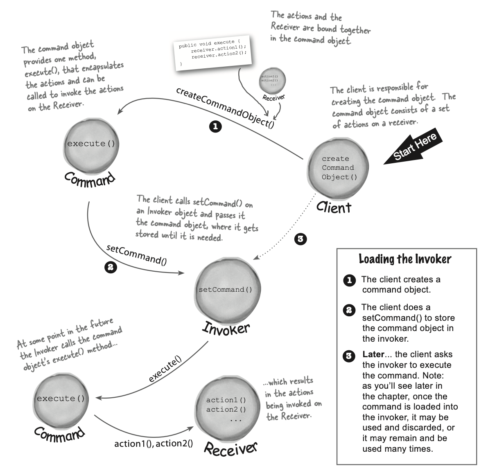
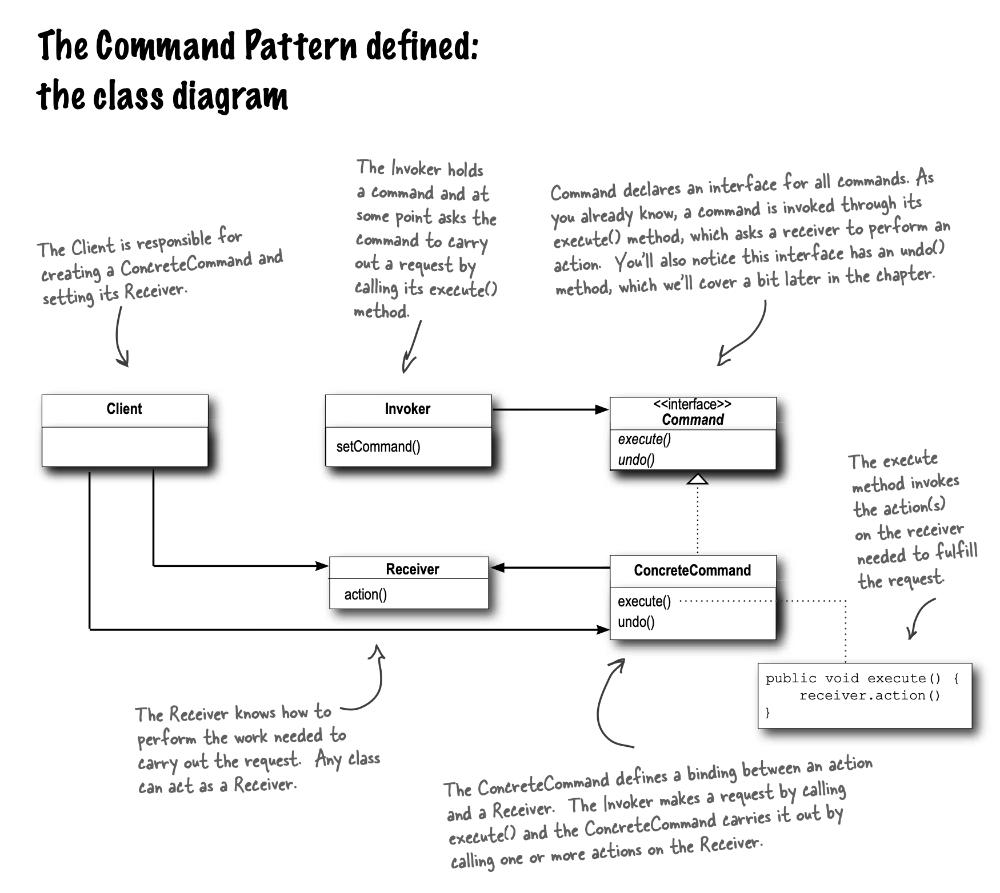
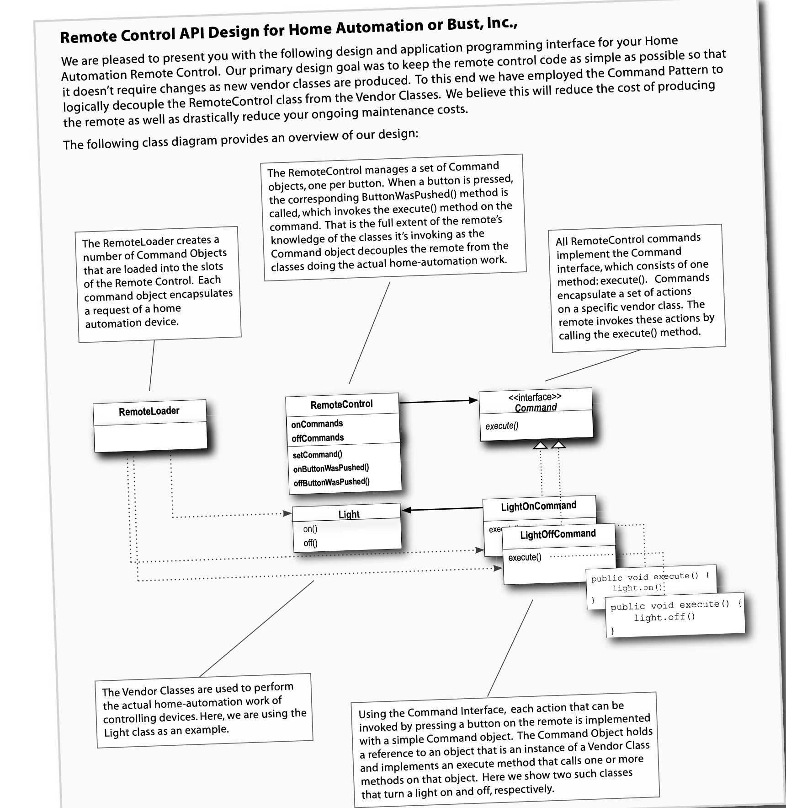
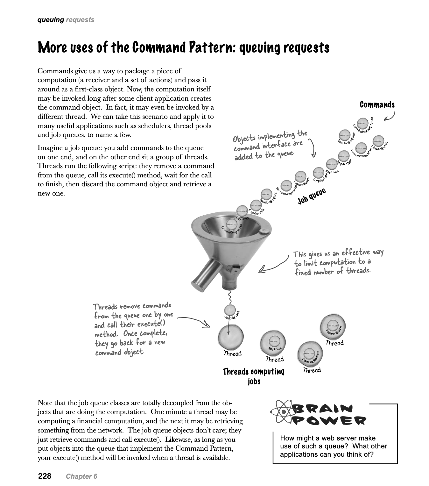
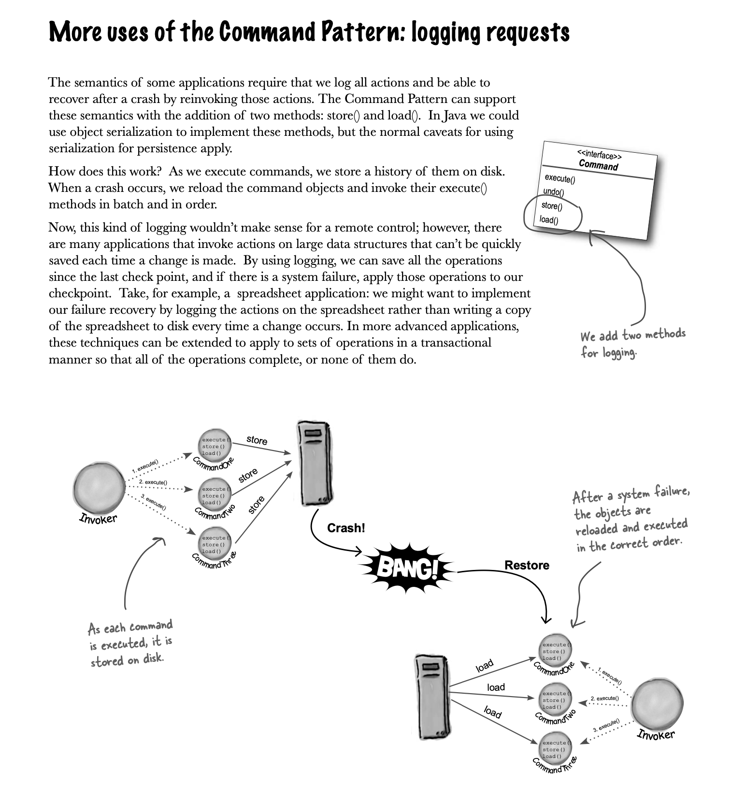

# Command

Encapsulates request to an object, allowing parameterization of other objects with different requests, queue, log requests.
Support undoable operation.

- Decoupling object making the request from the object receiving and executing the request.
- Meta command pattern: create macros of commands to execute multiple commands at once.
- **Pattern Honorable Mention:** Null Object
  - When you don't have meaningful object to return, yet you want to remove responsibility to handle **null** from client.
  - For example NoCommand object in remote control example.
- More use of command pattern: queueing requests. (throwback to Go channels?) and logging requests.
  - Implementing logging and transactional systems using command design pattern.

