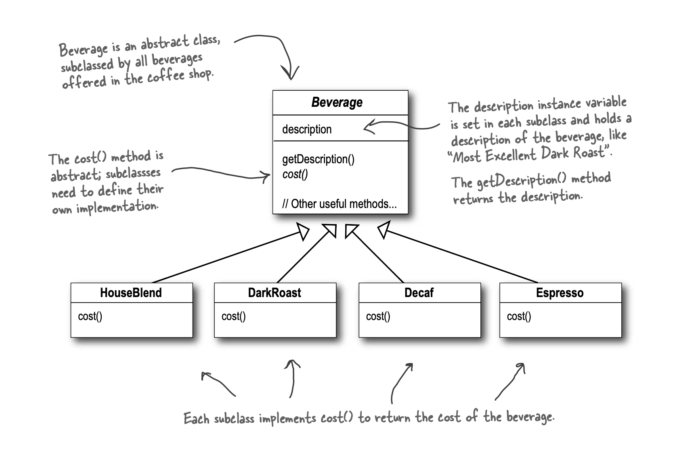
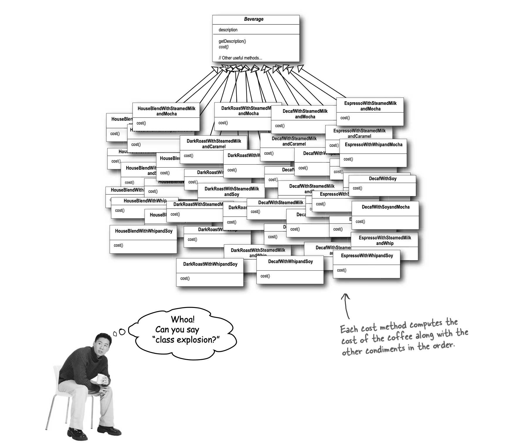
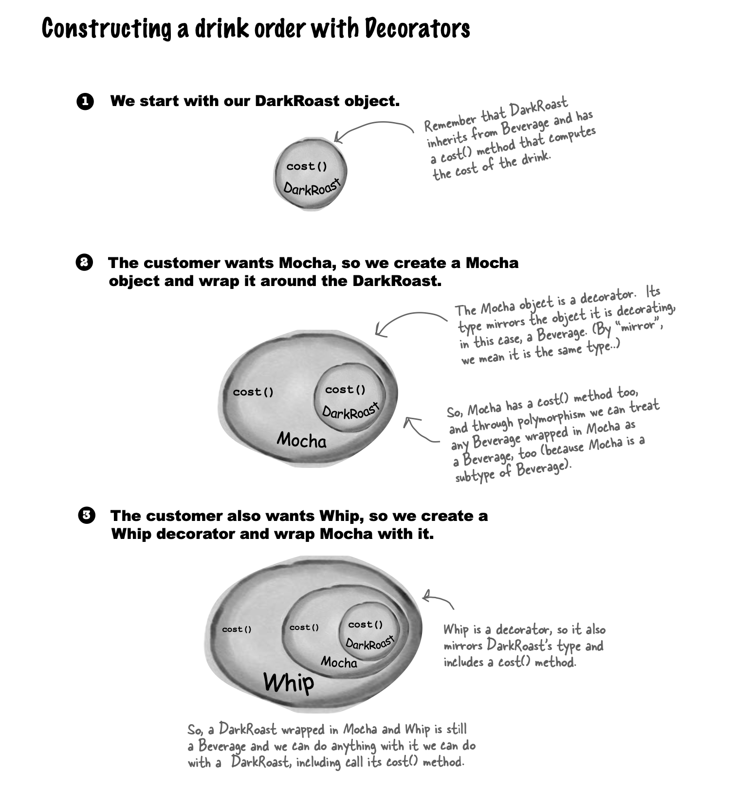
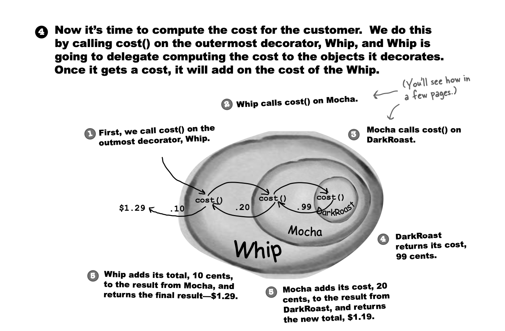
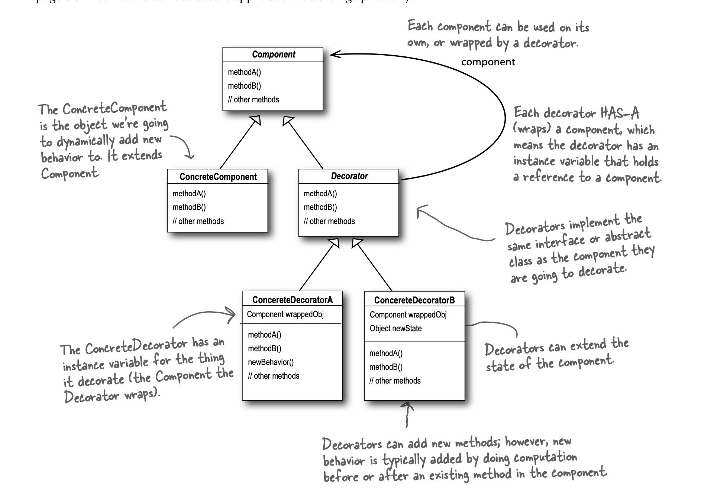
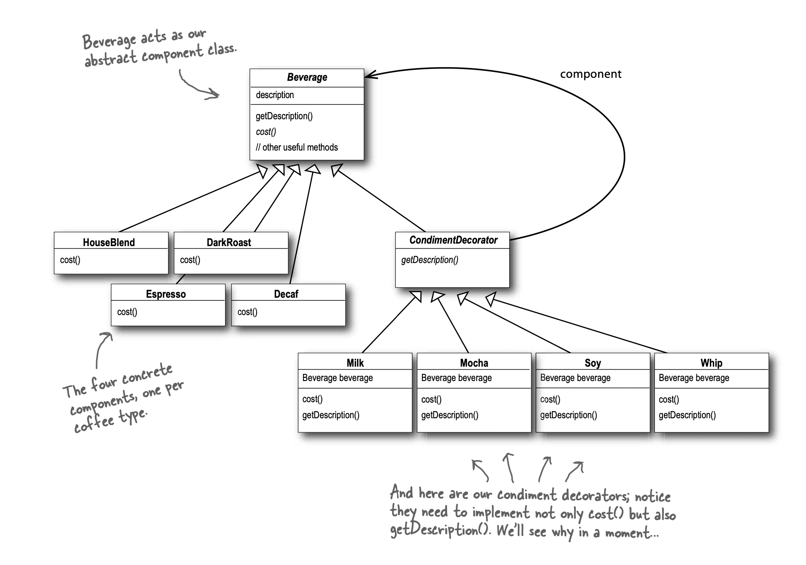
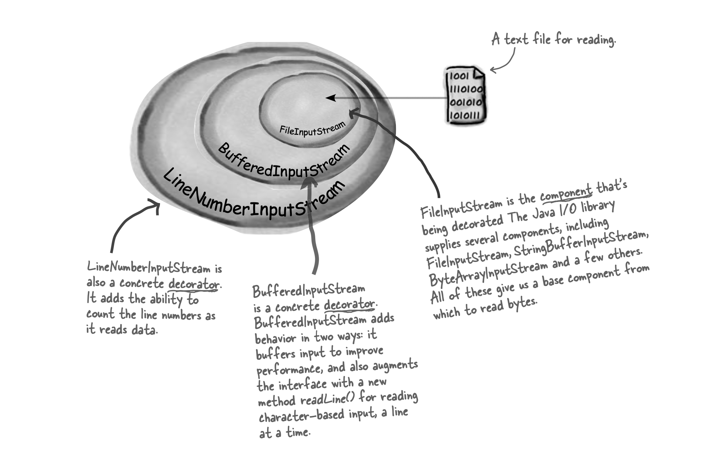
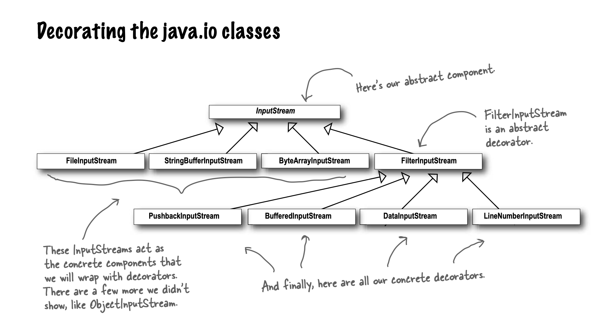

# Decorator

Attaches additional responsibilities to object dynamically.
Provide flexible alternative to subclasses for extending functionality.

- Classes should be open for extension, but closed for modification. (OCP)
- Decorators have same supertype as the objects they decorate.
- One or more decorators can be used to wrap an object.
- Decorated object can be passed in place of original/wrapped object.
- Objects can be decorated anytime including during runtime dynamically with as many decorators as needed.
- As long as code is written only against abstract component type, decorators will remain transparent.
  - Code against concrete types will cause decorator to break the code.
- Decorators are created using factory and builder patterns.
- Java IO package uses decorator patterns extensively.
- Decorators can result in many small small objects in design, overuse can be complex.

## TO-DO

Organize classes to condiments & coffees.
Add size parameter for decorators.
Implement Java IO decorator.
