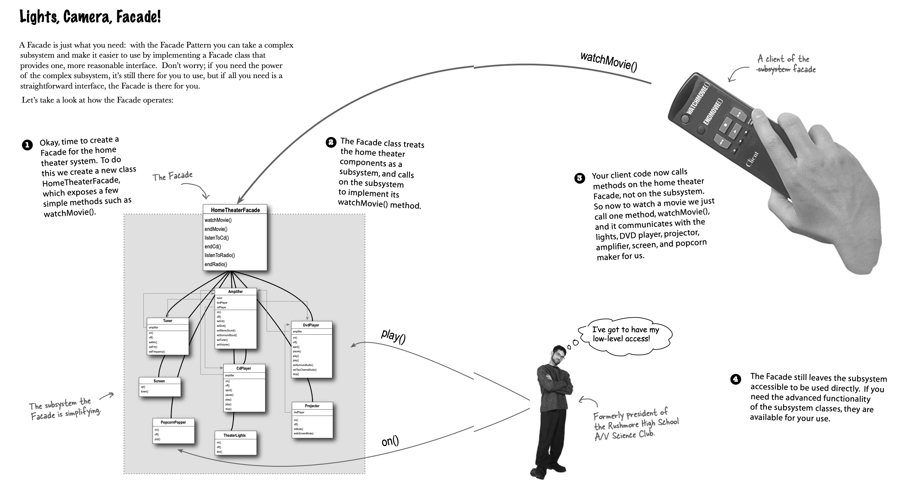
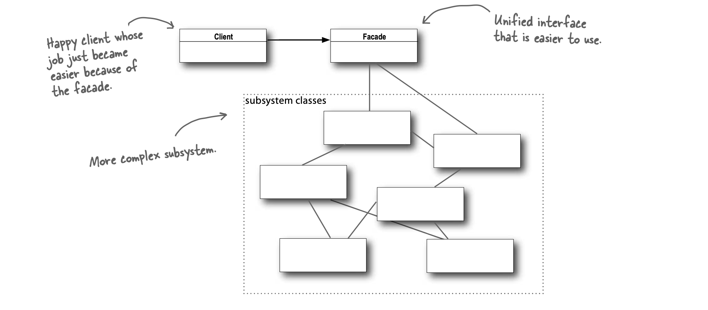
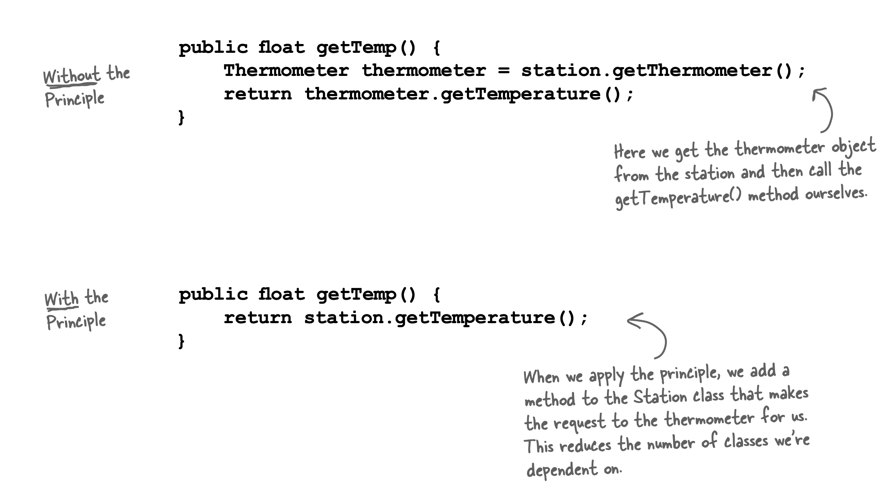

# Facade

Provides a unified interface to a set of interfaces in a subsystem.
Defines a higher level interface that makes subsystem easier to use.

- Take a complex subsystem and make it easier to use by implementing a Facade class that provides a more reasonable interface.
- Watching a movie hard way:
  - Turn on popcorn popper.
  - Start popper popping.
  - Dim the lights.
  - Put the screen down.
  - Turn the projector on.
  - Set the projector input to DVD.
  - Put projector on wide screen mode.
  - Turn the sound amplifier on.
  - Set the amplifier to DVD input.
  - Set the amplifier to surround sound.
  - Set the amplifier volume to medium (5).
  - Turn DVD player on.
  - Start DVD player playing.
  - 6 different classes involved!
- Using facade design pattern, this can be done in a simple way.
- Facade doesn't encapsulate subsystem classes, they merely provide a simplified interface to their functionality.
  - Subsystem classes still remain available for direct use by clients that need to use more specific interfaces.
- Facade design pattern allows decoupling client implementation from any single subsystem.
- Principle of least knowledge: Talk only to your immediate friends.
  - From any method in the object, only invoke methods that belong to:
    - Object itself.
    - Objects passed in parameter to method.
    - Any object the method creates or instantiates.
    - Any components of object ("HAS-A" relationship).
  - Also called **"Law Of Demeter"**.
  - Trade-off: Results in more wrapper classes being written to handle method calls to other components.
    - Increases development time, complexity and decreases runtime performance.

