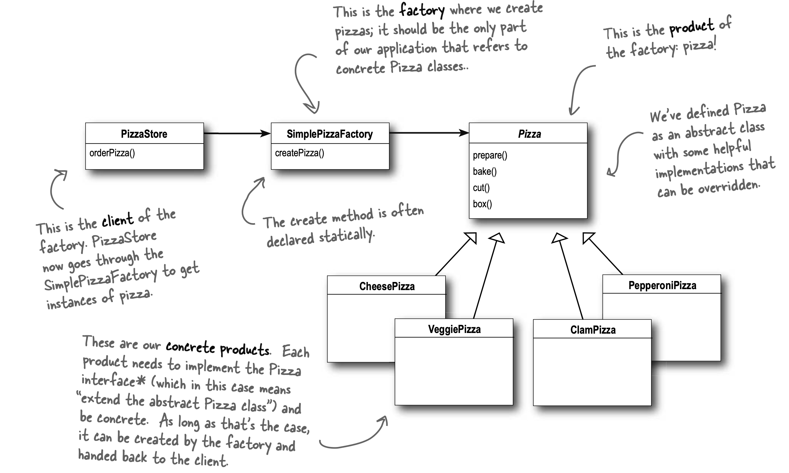

# Factory

Defines an interface for creating an object, but lets subclasses decide which class to instantiate.
It lets a class defer instantiation to subclasses.

- Instatiation is an activity that shouldn't always be done in public, can lead to coupling problems.
- "new" means "concrete", meaning implementation not interface.
- Tying class to concrete class can make it more fragile and less flexible.
- "simple static factory" vs "simple factory"
  - In simple static factory, object doesn't need to be instantiated.
  - However, in simple static factory, the class can't be subclassed to change behavior of create method.
- Simple factory isn't a design pattern but a programming idiom.
- Depend upon abstractions, don't depend on concrete classes. (Dependency Inversion Principle)
  - Higher level components should not depend on lower level components, both should depend on abstractions.
  - Called inversion principle because it inverts the thought of OO design.
- Guidelines to dependency inversion principle:
  - No variable should hold a reference to concrete class.
  - No class should derive from concrete class.
  - No method should override an implemented method of any of its base class.
- Abstract factory provides interface to create family of products without specifying concrete class.
  - Implement variety of factories that produce products meant for different contexts.
  - Substitute different factories to get different behaviors.
- Factory vs Abstract Factory
  - Factory uses inheritance
  - Abstract Factory uses composition
- All factories encapsulate object creation.

