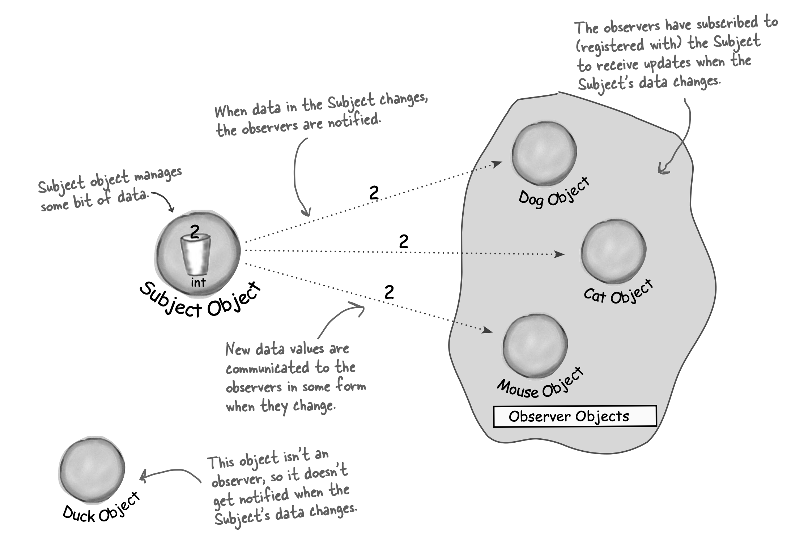

# Observer

Defines one-to-many dependency between objects so that when one object changes state, all dependents are notified and updated automatically.

- When 2 objects are loosely coupled, they can interact but have limited knowledge of each other.
- Observer pattern provides an object design where subjects and observers are loosely coupled.
- The only thing subject knows about observer is that it implements a certain interface.
- New observers can be added anytime. Likewise, observers can be replaced and removed anytime.
- Subject isn't modified to add new types of observers.
- Subjects or observers can be reused independently of each other.
- Changes to either subject or the observer won't affect the other.
- Strive for loosely coupled designs between objects that interact.
  - Crucial to build flexible OO systems that can handle change because they minimize interdependency.
- Swing makes heavy use of Observer pattern, many GUI frameworks do.
- 

# TO-DO

Java built-in Observer pattern has been deprecated. Use PropertyChangeListener instead.
