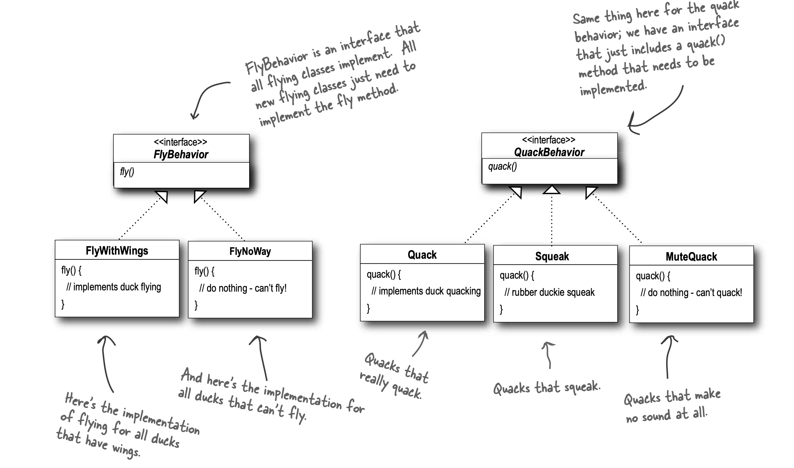
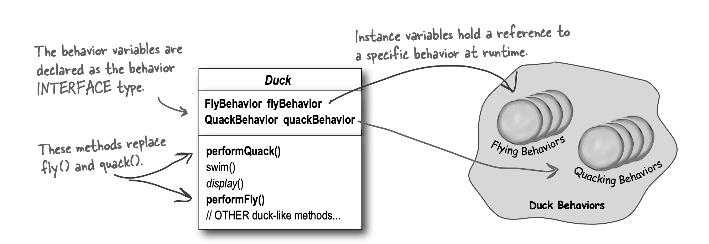
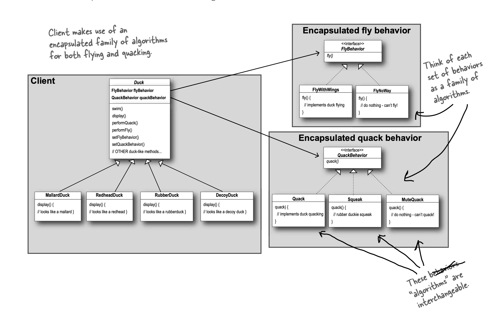

# Strategy

Defines family of algorithms, encapsulates each one and makes them interchangeable.
Strategy lets algorithm vary independently from clients that use it.

- Identify aspects of application that vary and separate from what stays same.
- Take what varies and encapsulate it so it won't affect rest of the code.
  - Fewer unintended consequences from code changes.
  - More flexibility in systems.
  - Basis of all design patterns.
- For example, in duck class, pull out flying and quacking behaviors as they vary.
  - Duck will delegate flying and quacking behavior instead of implementing them.
- Program to an interface, not an implementation.
  - Interface means supertype here, so it can be an abstract class too.
- Think of behaviors as family of algorithms.
- Favor composition over inheritance.
  - Enables encapsulation.
  - Allows changing behavior at runtime.

## Programming To Implementation vs Interface

### Programming To Implementation

```
Dog d = new Dog();
d.bark();
```

### Programming To Interface

```
Animal animal = new Animal();
animal.makeSound();
```

### Assigning Concrete Implementation At Runtime

```
a = getAnimal();
a.makeSound();
```





## TO-DO

Implement challenge section.
