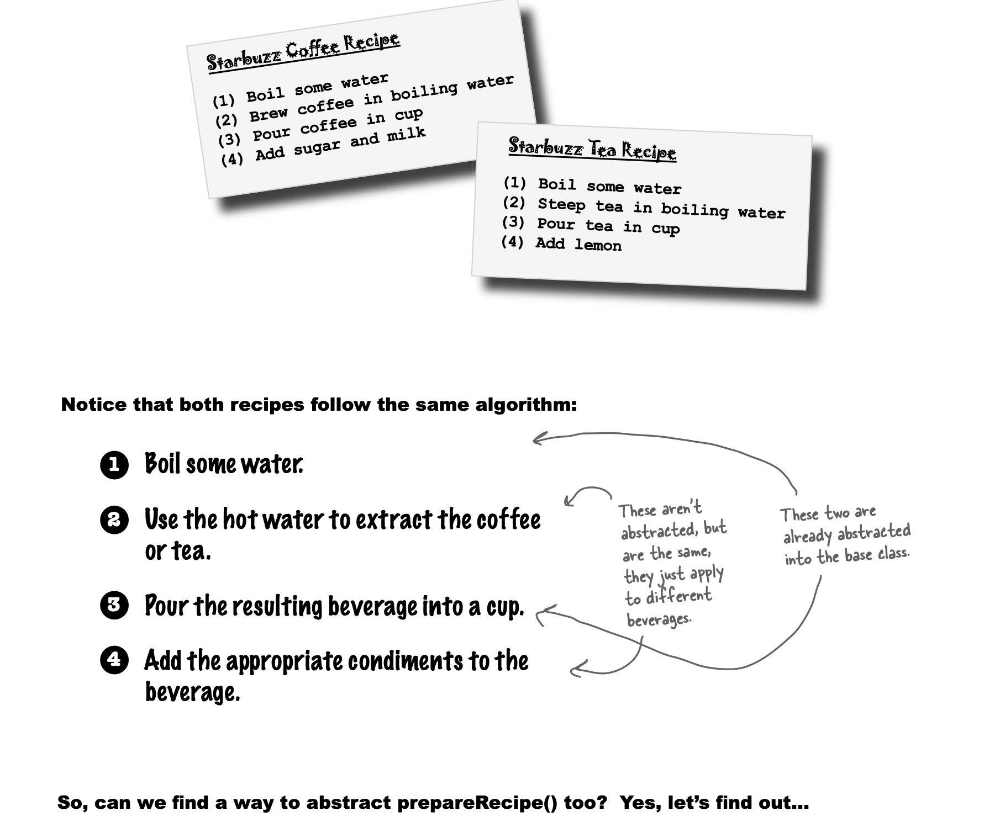
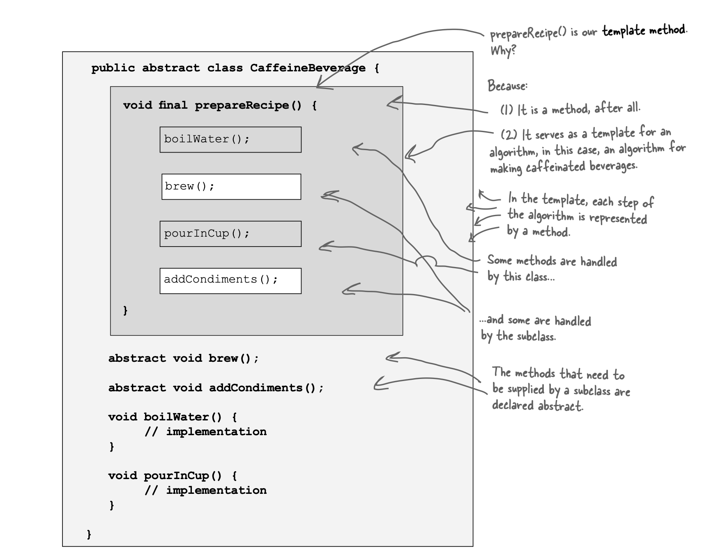
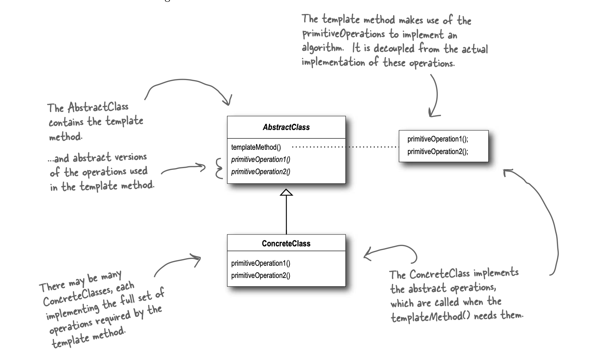

# Template

Defines skeleton of algorithm in a method, deferring some steps to subclasses.
It lets subclasses redefine certain steps of algorithm without changing the algorithm's structure.

- Template method pattern defines steps of algorithm and allows subclasses to provide implementation of 1 or more steps.
- Parent class has to define concrete methods, abstract methods and hooks.
- To prevent subclasses from changing the algorithm in template method, declare the template method as final.
- Advantages of using template method pattern:
  - Parent class is in control, it has algorithm and protects it.
  - Parent class maximizes reuse among the subclasses.
  - Algorithm lives in one place and code changes only need to be made there.
    - Without this pattern, code changes to algorithm require opening subclasses and making multiple changes.
  - Parent class provides a framework that other subclasses can be plugged into. New subclasses only need to implement a couple methods.
    - Without this pattern, classes are organized in a structure that require lot of work to add a new subclass.
  - Parent class concentrates knowledge about algorithm and relies on subclasses to provide complete implementations.
    - Without this pattern, knowledge of algorithm and how to implement it is distributed over many classes.
- Template method pattern is all about creating a template for the algorithm.
- Hook: Method is declared in abstract class but only given an empty or default implementation.
  - Allows subclasses the ability to "hook into" algorithm at various points or ignore the hook.
- Use abstract methods when subclass must provide an implementation. With hooks, subclass may choose to implement it or not.
- **Hollywood Principle:** Don't call us, we'll call you!
  - Prevents dependency rot (complex dependencies between multiple components).
  - Allows low level components to hook themselves to system, but high level components determine when they're needed and how.
- Dependency Inversion Principle vs Hollywood Principle
  - DIP teaches to avoid use of concrete classes and instead work as much as possible with abstractions.
  - Hollywood principle is a technique for building frameworks and components so that lower level components can be hooked into computation but without creating complex dependencies between high level and low level components.
  - DIP makes a much stronger and general statement about avoiding dependencies in design.
- Pattern comparison:
  - Strategy: Encapsulate interchangeable behaviors and use delegation to decide which behavior to use.
  - Template Method: Subclasses decide how to implement steps in an algorithm.
  - Factory Method: Subclasses decide which concrete classes to create.
- Example of template method pattern: Sorting in Arrays (compareTo is the abstract method)
- Factory method is specialization of Template method.

